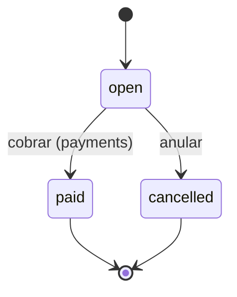

# Flujo de pedidos

## Ciclo de vida

- **open** (abierto): el pedido está activo; se agregan o quitan ítems.
- **paid** (pagado): se cobró y se cerró.
- **cancelled** (cancelado): se anuló.



## Regla del snapshot de precios

Los precios del menú cambian con el tiempo. Al agregar un ítem al pedido se guarda el **precio del momento** en `order_items`, para que el pedido no cambie de valor si se edita el menú después.

```sql
CREATE TABLE order_items (
  id           uuid PRIMARY KEY DEFAULT gen_random_uuid(),
  order_id     uuid NOT NULL REFERENCES orders(id),
  menu_item_id uuid NOT NULL REFERENCES menu_items(id),
  tenant_id    uuid NOT NULL REFERENCES tenants(id),
  quantity     int NOT NULL CHECK (quantity > 0),
  unit_price   numeric(12,2) NOT NULL, -- snapshot al momento de agregar
  created_at   timestamptz NOT NULL DEFAULT now()
);
```

- `unit_price` = `menu_items.price` **en el momento del alta**.
- El total del pedido se calcula con `SUM(quantity * unit_price)` — nunca con precios vivos del menú.
- Cambiar un precio sobre ítems ya agregados requiere corrección auditada, no edición silenciosa.

## Transición de estados

| De | A | Condición | Efecto |
| --- | --- | --- | --- |
| open | paid | Existe un pago registrado en `payments` | Se congela el pedido y se emite ticket |
| open | cancelled | Cancelación por el operador | El pedido queda histórico con estado cancelled |
| paid | cancelled | No permitido (integridad contable) | — |

## Relacionados

- [[../modules/orders|Módulo pedidos]]
- [[../modules/payments|Módulo pagos]]
- [[../modules/menu|Módulo menú]]